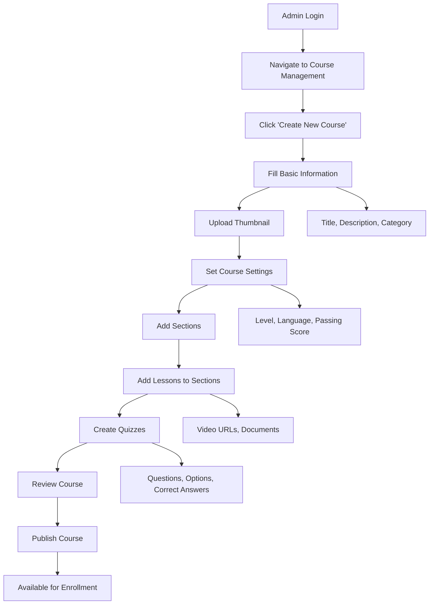
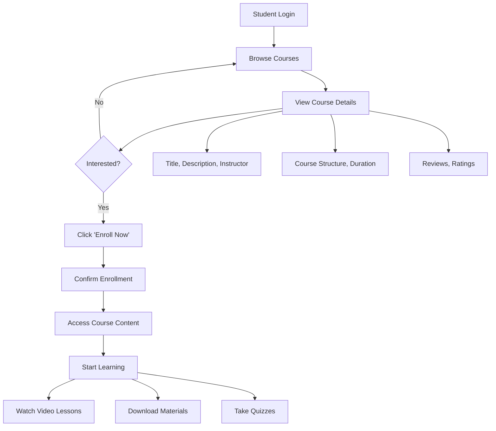
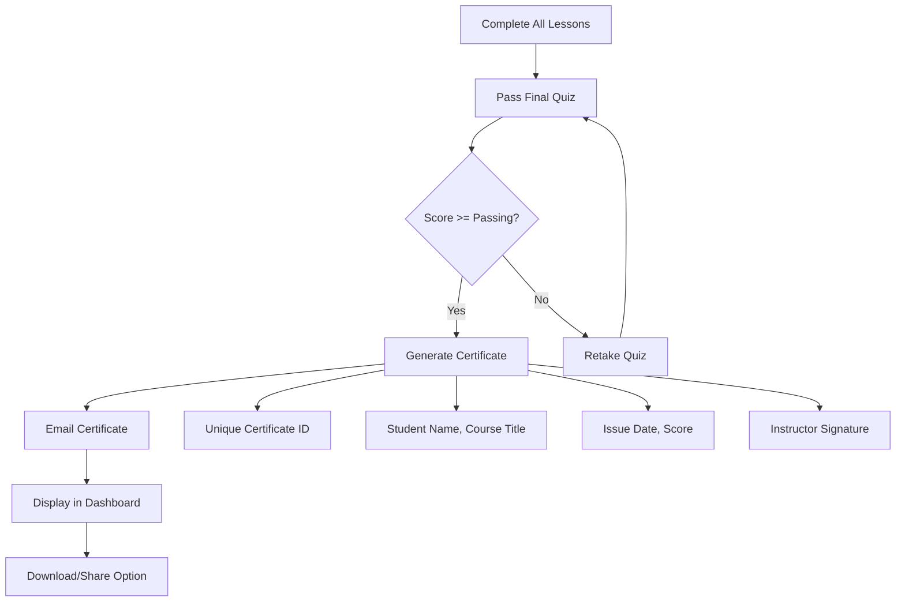
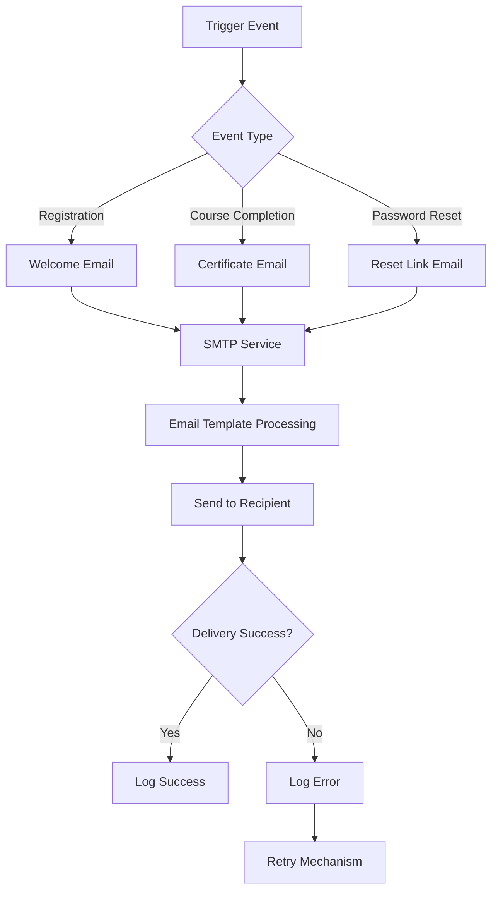
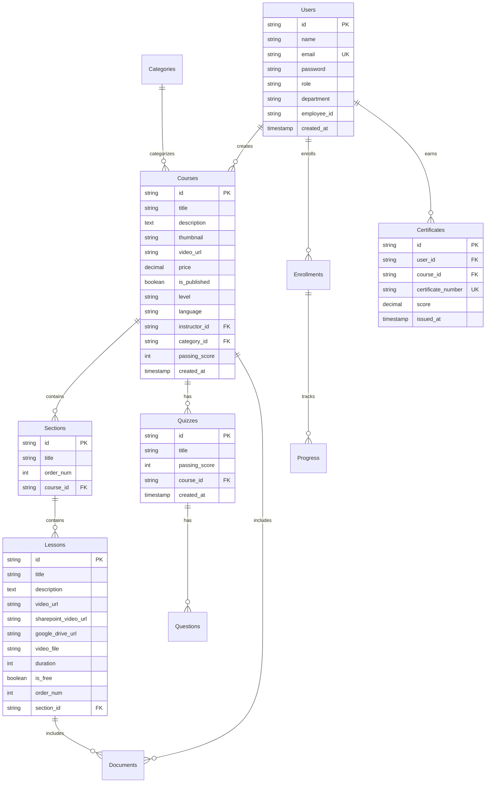

# Arohak LMS Project Flow Documentation

## Table of Contents
1. [System Overview](#system-overview)
2. [User Roles & Permissions](#user-roles--permissions)
3. [Core Workflows](#core-workflows)
4. [Process Flow Diagrams](#process-flow-diagrams)
5. [Step-by-Step Processes](#step-by-step-processes)
6. [Technical Architecture](#technical-architecture)
7. [Data Flow](#data-flow)

---

## System Overview

The Arohak Learning Management System (LMS) is a comprehensive platform designed for employee training and skill development. The system supports course creation, enrollment, progress tracking, and certification.

### Key Components
- **Frontend**: Next.js/React application
- **Backend**: NestJS API with MySQL database
- **Authentication**: JWT-based with role management
- **File Storage**: Local uploads for thumbnails and documents
- **Email Service**: SMTP integration for notifications

---

## User Roles & Permissions

### 1. Admin User
- ✅ Create, edit, and delete courses
- ✅ Manage course structure (sections, lessons, quizzes)
- ✅ Upload course materials and thumbnails
- ✅ View system statistics and analytics
- ✅ Manage user enrollments
- ✅ Publish/unpublish courses

### 2. Employee User
- ✅ Browse and enroll in published courses
- ✅ Track learning progress
- ✅ Complete lessons and quizzes
- ✅ Earn and view certificates
- ✅ Download course documents
- ✅ Update personal profile

---

## Core Workflows

### 1. Course Management Workflow
```
Admin Login → Course Creation → Content Upload → Structure Design → Quiz Creation → Publishing → Student Enrollment
```

### 2. Student Learning Workflow
```
Course Browse → Enrollment → Lesson Progress → Quiz Completion → Certificate Generation → Progress Tracking
```

### 3. Authentication Workflow
```
Registration → Email Verification → Login → Dashboard Access → Role-based Navigation
```

---

## Process Flow Diagrams

### 1. Course Creation Flow



### 2. Student Enrollment Flow



### 3. Certificate Generation Flow



### 4. Email Notification Flow



---

## Step-by-Step Processes

### 1. Course Creation Process (Admin)

#### Step 1: Course Basic Setup
1. **Login as Admin**
   - Navigate to `/admin/dashboard`
   - Click "Create Course" button

2. **Basic Information**
   ```
   - Title: "ERP Finance Module Training"
   - Description: Detailed course overview
   - Category: Select from dropdown
   - Level: Beginner/Intermediate/Advanced
   - Language: Course language
   - Passing Score: Minimum quiz percentage (70% default)
   ```

3. **Media Upload**
   - Upload course thumbnail (image file)
   - Set course video URL (YouTube/SharePoint/Google Drive)
   - Set course price (if applicable)

#### Step 2: Course Structure Design
1. **Add Sections**
   - Click "Add Section" button
   - Enter section title
   - Sections organize related lessons

2. **Add Lessons to Sections**
   - Click "Add Lesson" within each section
   - Set lesson title
   - Add video URLs:
     - YouTube URL
     - SharePoint URL  
     - Google Drive URL
   - Upload lesson documents

3. **Create Assessments**
   - Click "Add Quiz" button
   - Set quiz title and passing score
   - Add multiple choice questions
   - Set correct answers for each question

#### Step 3: Publishing
1. **Review Course**
   - Check all content is complete
   - Test video links and documents
   - Verify quiz functionality

2. **Publish Course**
   - Click "Publish" button
   - Course becomes available to employees
   - Enrollment notifications sent

### 2. Student Learning Process

#### Step 1: Course Discovery
1. **Browse Available Courses**
   - Navigate to `/courses`
   - Filter by category or level
   - Search by keywords

2. **Course Evaluation**
   - Read course description
   - View instructor information
   - Check course duration and structure
   - Read reviews and ratings

#### Step 2: Enrollment
1. **Enroll in Course**
   - Click "Enroll Now" button
   - Confirmation message appears
   - Course added to dashboard

2. **Start Learning**
   - Navigate to `/dashboard`
   - Click on enrolled course
   - Begin with first lesson

#### Step 3: Learning Progress
1. **Complete Lessons**
   - Watch video content
   - Download supporting materials
   - Mark lessons as complete

2. **Take Assessments**
   - Complete section quizzes
   - Pass with required score
   - Retake if necessary

3. **Track Progress**
   - View completion percentage
   - Monitor quiz scores
   - Check time spent

#### Step 4: Certification
1. **Complete Course**
   - Finish all lessons
   - Pass final assessment
   - Certificate automatically generated

2. **Receive Certificate**
   - Email notification sent
   - Certificate available in dashboard
   - Download or share certificate

### 3. Admin Management Process

#### Step 1: User Management
1. **View User Statistics**
   - Navigate to admin dashboard
   - View total users, enrollments, completions

2. **Monitor Progress**
   - Track individual student progress
   - View course completion rates
   - Identify struggling students

#### Step 2: Content Management
1. **Update Course Content**
   - Edit existing courses
   - Add new materials
   - Update quiz questions

2. **Quality Control**
   - Review course feedback
   - Update outdated content
   - Improve user experience

---

## Technical Architecture

### 1. Frontend Architecture
```
┌─────────────────────────────────────────┐
│              Next.js Frontend            │
├─────────────────────────────────────────┤
│  Pages:                                  │
│  ├── / (Landing)                         │
│  ├── /login                              │
│  ├── /register                           │
│  ├── /dashboard                          │
│  ├── /courses                            │
│  ├── /admin/dashboard                   │
│  └── /admin/courses/[id]/edit           │
├─────────────────────────────────────────┤
│  Components:                             │
│  ├── Layout (Navbar, Sidebar)           │
│  ├── Forms (Course, Lesson, Quiz)        │
│  ├── Cards (Course, Certificate)         │
│  └── Modals (Confirm, Success)           │
└─────────────────────────────────────────┘
```

### 2. Backend Architecture
```
┌─────────────────────────────────────────┐
│              NestJS Backend              │
├─────────────────────────────────────────┤
│  Modules:                                │
│  ├── Auth (JWT, Guards)                  │
│  ├── Users (Profile, Roles)              │
│  ├── Courses (CRUD, Structure)           │
│  ├── Lessons (Content, Videos)           │
│  ├── Quizzes (Questions, Scoring)        │
│  ├── Certificates (Generation)           │
│  ├── Documents (Upload, Serve)           │
│  └── Mail (SMTP, Templates)               │
├─────────────────────────────────────────┤
│  Database:                               │
│  ├── Users                               │
│  ├── Categories                         │
│  ├── Courses                            │
│  ├── Sections                           │
│  ├── Lessons                            │
│  ├── Quizzes                            │
│  ├── Certificates                       │
│  └── Enrollments                        │
└─────────────────────────────────────────┘
```

### 3. Database Schema


---

## Data Flow

### 1. Authentication Flow
```
User Input → Frontend Validation → API Request → JWT Verification → Role Check → Dashboard Access
```

### 2. Course Content Flow
```
Admin Upload → File Storage → Database Record → Static File Serving → Frontend Display
```

### 3. Progress Tracking Flow
```
Lesson Completion → Progress Update → Database Storage → Dashboard Refresh → Certificate Check
```

### 4. Email Notification Flow
```
Event Trigger → Template Processing → SMTP Service → Email Delivery → Status Logging
```

---

## Security Considerations

### 1. Authentication & Authorization
- JWT tokens with expiration
- Role-based access control
- Password hashing with bcrypt
- Session management

### 2. Data Protection
- Input validation and sanitization
- SQL injection prevention
- XSS protection
- File upload restrictions

### 3. API Security
- CORS configuration
- Rate limiting
- Request validation
- Error handling without information leakage

---

## Performance Optimizations

### 1. Frontend
- Lazy loading for course content
- Image optimization
- Code splitting
- Caching strategies

### 2. Backend
- Database indexing
- Query optimization
- File caching
- Connection pooling

### 3. Database
- Proper indexing on foreign keys
- Query optimization
- Connection management
- Backup strategies

---

## Monitoring & Logging

### 1. Application Logs
- User activity tracking
- Error logging
- Performance metrics
- Security events

### 2. System Monitoring
- Server performance
- Database health
- File storage usage
- Email delivery status

---

## Deployment Architecture

### 1. Development Environment
```
Local Development → Git Repository → Feature Branches → Pull Requests → Main Branch
```

### 2. Production Environment
```
Build Process → Deployment → Database Migration → Static File Setup → Service Start
```

---

## Future Enhancements

### 1. Planned Features
- Advanced analytics dashboard
- Video streaming optimization
- Mobile application
- Integration with HR systems
- Advanced reporting tools

### 2. Technical Improvements
- Microservices architecture
- Cloud storage integration
- Real-time notifications
- AI-powered recommendations

---

## Support & Maintenance

### 1. Regular Tasks
- Database backups
- Security updates
- Performance monitoring
- User support

### 2. Troubleshooting
- Common issues and solutions
- Debug procedures
- Performance tuning
- Error resolution

---

*This documentation provides a comprehensive overview of the Arohak LMS project flow, processes, and technical architecture. For specific implementation details, refer to the codebase and API documentation.*
